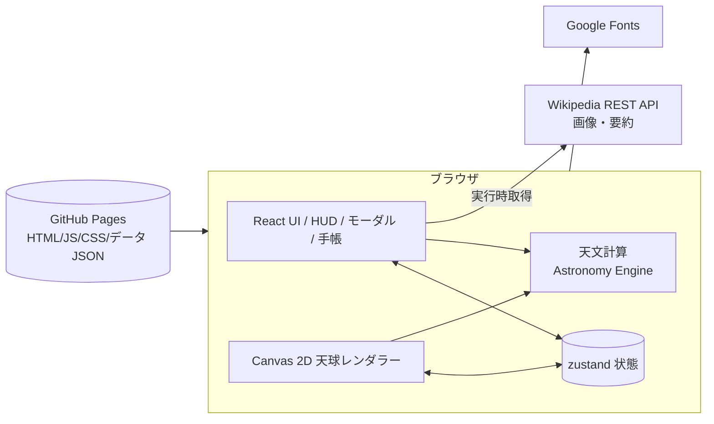
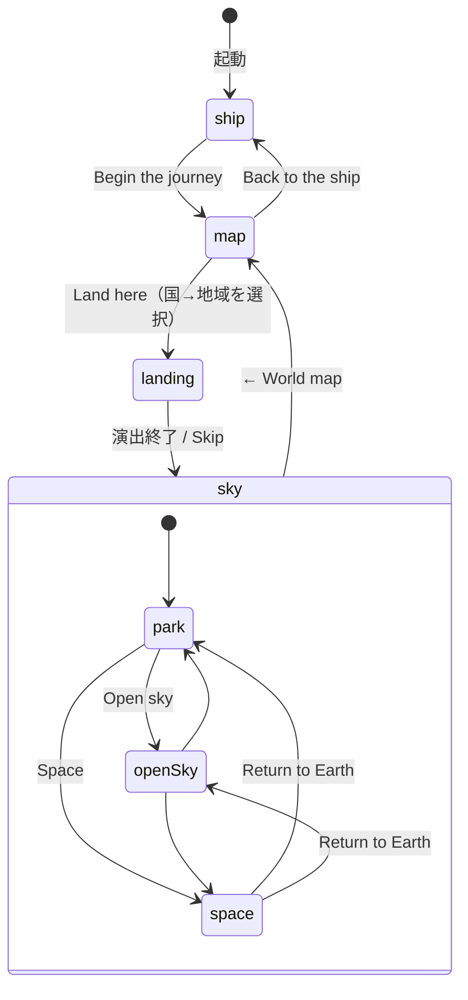

# 基本設計書

| 項目 | 内容 |
| --- | --- |
| システム名 | Little Sky（星座アトラス） |
| 版数 | 1.0 |
| 作成日 | 2026-10-09 |
| 関連文書 | [要件定義書](01_要件定義書.md)、[詳細設計書](03_詳細設計書.md) |

## 1. システム構成

静的ファイルだけで動くシングルページアプリ（SPA）。サーバー側の処理・DB はない。

| 要素 | 内容 |
| --- | --- |
| ホスティング | GitHub Pages（GitHub Actions で自動デプロイ） |
| 実行時の外部通信 | Wikipedia REST API（写真・要約）、Google Fonts（フォント）のみ |
| 永続化 | なし（状態はメモリ上。リロードで初期化） |

## 2. 画面遷移

| シーン | 概要 |
| --- | --- |
| ship | 宇宙船の船内。モニターに世界地図が映る。キャラクターが操縦席にいる |
| map | モニターにズームして地図が全画面になる。国選択 → 国へズーム → 地域選択 |
| landing | 大気圏突入〜着陸の演出。終了時の空の色は選んだ地点・時刻の実際の太陽高度に合わせる |
| sky | 空の本体。公園／全天／宇宙の 3 モード |

## 3. 画面設計（sky シーン）

| 領域 | 内容 |
| --- | --- |
| 左上 | 「← World map」。宇宙モード時は「Return to Earth」を追加 |
| 中央上 | モード切替（Park／Open sky／Space） |
| 右上 | 手帳の開閉 |
| 左上（2 段目） | 場所・緯度経度・現地日時・時間帯（Daytime／Night など） |
| 下左 | 時刻バー（日・月ジャンプ、±12h スライダー、Now）、太陽を隠す（Paper／Hero）、ズーム、元の向きへ |
| 下右 | 表示切替（Figures／Names／Borders／Deep sky） |
| 中央 | 空（Canvas）。公園モードは下部にキャラクターと丘・木々 |
| ホバー | 名前と種別のタグ。星座は線を強調 |
| モーダル | 星座・恒星・惑星・星雲の詳細カード（ポラロイド写真＋データ） |
| 手帳 | 右下。検索、今見えるものの一覧、詳細（見える時刻・見頃） |

## 4. 機能一覧とモジュール対応

| 機能 | 主なモジュール |
| --- | --- |
| 世界地図・地域選択 | `scenes/MapScene.tsx`、`data/cities.ts` |
| 船内・着陸の演出 | `scenes/ShipScene.tsx`、`scenes/LandingScene.tsx`、`scenes/WarpField.tsx` |
| 空の描画 | `sky/renderer.ts`、`sky/SkyCanvas.tsx`、`sky/milkyWay.ts` |
| 操作（ドラッグ・ズーム・当たり判定） | `sky/SkyCanvas.tsx`、`sky/renderer.ts`（hitTest） |
| 太陽を隠す | `sky/SunBlocker.tsx`、`characters/*` |
| 天文計算 | `astro/coords.ts`、`projection.ts`、`bodies.ts`、`visibility.ts`、`skyColor.ts`、`starColor.ts` |
| 星表・解説データ | `data/loadCatalog.ts`、`constellations.en.ts`、`stars.en.ts`、`planets.en.ts`、`dsos.en.ts`、`glossary.ts` |
| 詳細モーダル・星図 | `ui/InfoModal.tsx`、`ui/StarChart.tsx`、`ui/VisibilityPanel.tsx`、`data/wiki.ts` |
| 手帳 | `ui/Notebook.tsx` |
| HUD | `ui/Hud.tsx` |
| 状態管理 | `store/useAppStore.ts` |

## 5. 天文計算方式

| 項目 | 方式 |
| --- | --- |
| 座標系 | 星表は J2000 赤道座標。地平座標（x=北、y=西、z=天頂）へは Astronomy Engine の `Rotation_EQJ_HOR`（歳差・章動を含む）で変換 |
| 投影 | 立体射影（stereographic）。画面半高さ ↔ 視野角で縮尺を決定。逆変換も実装し、地面・天の川の描画に使う |
| 太陽・月・惑星 | Astronomy Engine で観測地点からの位置（視差を含む）、明るさ、位相、離角、距離を算出 |
| 空の色・限界等級 | 太陽高度から、昼・薄明（市民／航海／天文）・夜の段階的な配色と、見える最も暗い星の等級を補間 |
| 星の色 | B−V 色指数 → 有効温度（Ballesteros の式）→ 黒体色 |
| 可視性（出没・南中・見頃） | 10 分刻みで 24 時間を走査して出没・最大高度を求める。月ごとの見頃は月中旬の 1 日を 1 時間刻みで走査。惑星・太陽・月は `SearchRiseSet` で厳密に算出 |
| 見頃の日付 | 星座の中心が 21 時（地方平均太陽時）に南中する日（太陽の赤経＝対象の赤経−9h） |
| タイムゾーン | `tz-lookup` で緯度経度から IANA ゾーンを決定し、`Intl.DateTimeFormat` で現地時刻を表示 |

## 6. データ設計

### 6.1 静的データ（`public/data/`）

| ファイル | 内容 | 出典 |
| --- | --- | --- |
| `stars.6.json` | 6 等星までの恒星（HIP 番号、位置、等級、B−V）約 5,044 個 | d3-celestial（Hipparcos 由来） |
| `starnames.json` | 固有名・バイエル符号・HD/HIP・所属星座 | 同上 |
| `constellations.json` / `constellations.lines.json` / `constellations.borders.json` | 星座の名称・中心、星座線、境界線 | 同上（IAU の 88 星座） |
| `mw.json` | 天の川の等輝度輪郭（5 段階） | 同上 |
| `dsos.6.json` / `dsonames.json` | 星雲・星団・銀河と固有名（名前付き 135 件を使用） | 同上 |
| `countries-50m.json` | 国境（TopoJSON） | Natural Earth（world-atlas） |

### 6.2 解説データ（`src/data/`、手書き・英語）

| ファイル | 内容 | 件数 |
| --- | --- | --- |
| `constellations.en.ts` | 意味・面積・導入者。うち神話あり 37、豆知識あり 52 | 88 |
| `stars.en.ts` | スペクトル型・距離・種類・年齢・光度・豆知識 | 62 |
| `planets.en.ts` | 太陽・月・8 惑星の物理量と豆知識 | 10 |
| `dsos.en.ts` | 距離・大きさ・年齢・解説 | 21 |
| `cities.ts` | 国別の代表都市（緯度経度） | 73 か国 181 都市 |
| `glossary.ts` | 用語解説（赤方偏移、赤色巨星など） | 17 |

### 6.3 実行時の状態（zustand）

`scene`、`mode`、`place{name,lat,lon,tz}`、`offsetMs`（現在からの時刻差）、`selection`、`notebookOpen`、`sunBlocked`、`blockStyle`、表示切替フラグ、`resetTick`、`actionPose`、`lastGround`。

## 7. 外部インターフェース

| 相手 | 用途 | 方式 | 異常時 |
| --- | --- | --- | --- |
| Wikipedia REST API | 星座の写真・要約 | `page/summary`、`page/media-list`（GET、CORS 可） | 取得失敗時は IAU 図 → 自作星図に切替 |
| Google Fonts | Cormorant Garamond、Inter | CSS | 失敗時はシステムフォント |

## 8. 非機能設計

| 区分 | 設計 |
| --- | --- |
| 性能 | 恒星は型付き配列で保持し、毎フレーム行列を 1 回適用。天の川・地面は 1/4 解像度で逆投影して描画し拡大表示 |
| 操作 | Pointer Events を使用（マウス・タッチ兼用）。慣性、ピンチズーム、ホイールズーム |
| 可用性 | 静的配信。Wikipedia 障害時もコア機能は動作 |
| セキュリティ | 秘密情報なし、認証なし。外部コンテンツは画像と要約文のみで、HTML としては解釈しない（テキスト表示） |
| 保守性 | TypeScript strict。天文計算（`src/astro`）は UI から独立し単体で検証可能 |
| アクセシビリティ | 主要ボタンにラベル／`aria`。キーボードは Esc でモーダルを閉じる程度（本格対応は未実施） |
